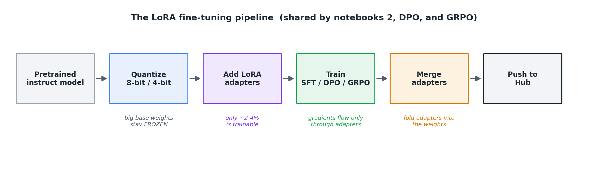
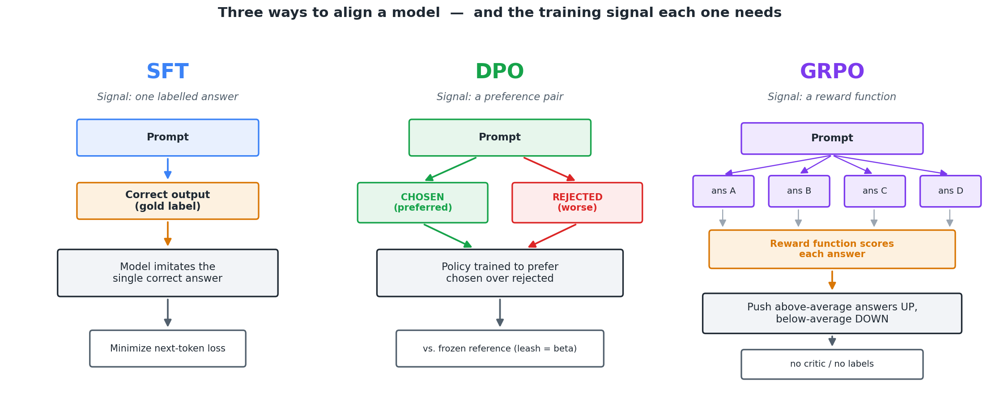

# LLM-Finetuning

A hands-on, notebook-based course on the core techniques for running and **fine-tuning large language models (LLMs)** on modest hardware, using Llama 3.2 / Qwen 2.5 and the Hugging Face ecosystem (`transformers`, `bitsandbytes`, `peft`, `trl`, `unsloth`).

This repository is designed to be used as **teaching material**. Each concept is explained here in the README, and each notebook demonstrates it in runnable code with line-by-line comments and recorded outputs.

> Every notebook is designed to run on a **GPU runtime** (e.g. Google Colab). Where a gated model is used, it authenticates to the Hugging Face Hub with a token read from a local `.env` file.

---

## Suggested learning path

Work through the notebooks in this order — each one builds on the previous:

| # | Notebook | Question it answers | New concepts |
|---|----------|---------------------|--------------|
| 1 | [`1-Quantization.ipynb`](1-Quantization.ipynb) | How do I fit a big model into a small GPU? | Quantization (32/16/8/4-bit) |
| 2 | [`2-InstructVsBaseModel.ipynb`](2-InstructVsBaseModel.ipynb) | How do I teach a model a new skill cheaply? | Base vs. instruct, chat templates, **SFT**, **LoRA** |
| 3 | [`3-DPO.ipynb`](3-DPO.ipynb) | How do I make a model *prefer* good answers over bad ones? | **DPO** (preference alignment) |
| 4 | [`GRPO.ipynb`](GRPO.ipynb) | How do I teach a model to *reason* when I have no labels? | **GRPO** (RL from reward functions) |
| 5 | [`Thinking__(REASONING)_model.ipynb`](Thinking__(REASONING)_model.ipynb) | What does a finished reasoning model look like? | Chain-of-thought / `<think>` models |

---

## Table of contents

- [Key concepts](#key-concepts)
  - [1. Quantization](#1-quantization)
  - [2. Tokenization — and why the tokenizer is *not* fine-tuned](#2-tokenization--and-why-the-tokenizer-is-not-fine-tuned)
  - [3. Base vs. instruct models & chat templates](#3-base-vs-instruct-models--chat-templates)
  - [4. Fine-tuning and SFT](#4-fine-tuning-and-sft)
  - [5. LoRA (Low-Rank Adaptation)](#5-lora-low-rank-adaptation)
  - [6. Aligning a model: SFT vs. DPO vs. GRPO](#6-aligning-a-model-sft-vs-dpo-vs-grpo)
  - [7. DPO (Direct Preference Optimization)](#7-dpo-direct-preference-optimization)
  - [8. GRPO (Group Relative Policy Optimization)](#8-grpo-group-relative-policy-optimization)
  - [9. Reasoning / chain-of-thought models](#9-reasoning--chain-of-thought-models)
- [The notebooks](#the-notebooks)
- [Setup](#setup)
- [Requirements](#requirements)
- [Glossary](#glossary)

---

## Key concepts

### 1. Quantization

A neural network is just a large collection of numbers (**weights**). By default those numbers are stored as 32-bit floating point (`float32`), which takes **4 bytes per weight**. A 1-billion-parameter model therefore needs ~4 GB *just to hold the weights* — before you add activations, gradients, or optimizer state.

**Quantization** reduces the number of bits used to store each weight. Fewer bits → less memory and faster memory transfers, at the cost of some numerical precision.

| Precision | dtype | Bytes / weight | ~Size of a 1.24B model | Typical use |
|-----------|-----------|----------------|------------------------|-------------|
| 32-bit | `float32` | 4 | ~4.6 GB | Full precision / training reference |
| 16-bit | `bfloat16` / `float16` | 2 | ~2.3 GB | Standard for training & inference |
| 8-bit | `int8` (LLM.int8) | ~1 | ~1.4 GB | Memory-efficient inference / LoRA training |
| 4-bit | `NF4` (QLoRA) | ~0.5 | ~0.9 GB | Maximum compression |

**How does 8-bit / 4-bit work?** Instead of storing a real number directly, the library (`bitsandbytes`) stores a small integer plus a scaling factor per block of weights. At compute time the integers are de-quantized back to a float, multiplied, and the result accumulated in higher precision. Schemes like **LLM.int8()** keep the rare large-magnitude "outlier" features in 16-bit so accuracy barely changes, while **NF4** (used in QLoRA) uses a data type tuned for the bell-curve distribution of neural-network weights.

**Why it matters for fine-tuning:** quantization is what lets us load a model in 8-bit or 4-bit and *still* fine-tune it on a single small GPU — because only the tiny LoRA adapters (see below) need full-precision gradients, while the big frozen base stays compressed.

```python
from transformers import BitsAndBytesConfig
config_8bit = BitsAndBytesConfig(load_in_8bit=True)          # 8-bit
config_4bit = BitsAndBytesConfig(load_in_4bit=True,          # 4-bit (QLoRA-style)
                                 bnb_4bit_quant_type="nf4")
```

### 2. Tokenization — and why the tokenizer is *not* fine-tuned

This is a point that trips up almost everyone, so it deserves its own section.

A model cannot read text; it reads **token IDs** (integers). The **tokenizer** is the component that converts text ↔ IDs:

```
"list docker containers"  ──tokenizer──▶  [1214, 27686, 18021, 7086]  ──model──▶  predictions
```

There are **two completely separate "training" processes**, and they are easy to confuse:

| | **Training the tokenizer** | **Fine-tuning the model** |
|---|---|---|
| **What is learned** | The **vocabulary** and merge rules — which character sequences become which tokens (e.g. via Byte-Pair Encoding / BPE) | The model's **weights** — the billions of numbers that turn token IDs into predictions |
| **Data used** | A large raw text corpus, analyzed for frequent sub-word patterns | Labelled examples of the task (input → desired output) |
| **When it happens** | **Once, upstream**, by the model's original authors, before the model is ever trained | Later, by *you*, to adapt a pretrained model to a task |
| **In these notebooks** | **Not done.** We *load* the pretrained tokenizer with `AutoTokenizer.from_pretrained(...)` and reuse it unchanged | **This is the whole point** — we update (a small slice of) the weights |

**Key takeaway:** in every fine-tuning notebook here, the tokenizer is **frozen and reused as-is** — we never re-learn the vocabulary. The tokenizer only does three jobs for us:

1. **Encodes** our text into `input_ids` + `attention_mask`.
2. **Applies the chat template** — it knows the special tokens that turn a list of `system` / `user` / `assistant` messages into the exact string the instruct model expects.
3. **Handles padding** — e.g. Llama has no dedicated pad token, so we reuse the end-of-sequence token (`tokenizer.pad_token = tokenizer.eos_token`).

So "doing tokenization" means **using** the tokenizer, not **training** it. All the actual learning during fine-tuning happens in the model's LoRA weights. (You would re-train or extend a tokenizer only if your data used a language, alphabet, or domain vocabulary the original handles badly — a different, rarer task, out of scope here.)

### 3. Base vs. instruct models & chat templates

LLMs come in two common flavors, and knowing the difference is the key to using them correctly:

| Aspect | **Base model** | **Instruct model** |
|--------|----------------|--------------------|
| **Training** | Pretrained only — predicts the next token on raw internet-scale text | Base model **+** instruction tuning (SFT / RLHF) |
| **Behaviour** | *Continues* / completes text; does not "follow" requests | Follows instructions, answers questions, holds a chat |
| **Input format** | Plain text | A **chat template**: `system` / `user` / `assistant` turns wrapped in special tokens |

An instruct model is trained to expect a **chat template** built from model-specific special tokens. For Llama 3.2 a formatted conversation looks like this:

```text
<|begin_of_text|><|start_header_id|>system<|end_header_id|>
...system prompt...<|eot_id|><|start_header_id|>user<|end_header_id|>
...user message...<|eot_id|><|start_header_id|>assistant<|end_header_id|>
```

Different model families use different tokens: **Mistral** uses `[INST] ... [/INST]` with `<s>`/`</s>`, and **Qwen** uses `<|im_start|>` / `<|im_end|>`. A **base** model has never seen any of these tokens, so feeding it a chat template works poorly — and feeding a raw prompt to an instruct model wastes its training.

### 4. Fine-tuning and SFT

**Fine-tuning** = taking a model that already knows a lot (from pretraining) and nudging its weights so it performs a *specific* task well.

**Supervised Fine-Tuning (SFT)** is the most common recipe: you give the model input→output examples, it predicts the next token at every position, and the loss measures how wrong those predictions are. Gradient descent then updates the weights to reduce that loss.

Two supporting mechanics you'll see in the notebooks:

- **Data collator & dynamic padding** — sequences have different lengths, so `DataCollatorForLanguageModeling(mlm=False)` pads each *batch* to its own longest sequence and builds the shifted `labels` automatically (causal LM = predict the next token).
- **Label masking** — padded positions get a label of `-100` so the loss function **ignores** them; the model is never rewarded or penalized for what it "predicts" on padding.

SFT is great when you have **correct example outputs**. When you instead have *preferences* ("A is better than B") or only a way to *score* an answer, you reach for DPO or GRPO (below).

### 5. LoRA (Low-Rank Adaptation)

Fine-tuning **every** weight of a billion-parameter model is expensive: you must store gradients and optimizer state for *all* of them, and you end up with a full-size copy of the model for every task. **LoRA** sidesteps this and is used in *all three* fine-tuning notebooks here.

**The idea.** For a pretrained weight matrix `W` (shape `d × d`), LoRA keeps `W` **frozen** and learns a small *low-rank* update instead of modifying `W` directly:

```
ΔW = B · A       where   A ∈ ℝ^(r × d),   B ∈ ℝ^(d × r),   r ≪ d
```

so a layer's output becomes:

```
h = W·x + (α / r) · B · A · x
```

Only the small matrices `A` and `B` are trained; `W` never changes. Because the rank `r` is tiny compared to `d`, the number of trainable parameters collapses — often to just **2–4%** of the model.

**Why we use LoRA:**

- **It fits on a small GPU.** Combined with 8-bit/4-bit quantization, only the tiny adapters need gradients and optimizer state.
- **It is faster and cheaper** to train than full fine-tuning.
- **Adapters are tiny and portable** — a saved adapter is a few MB, so you can keep one base model and hot-swap task-specific adapters.
- **No catastrophic forgetting** — the base weights are untouched, so the model keeps its general abilities.

The LoRA knobs (set via `LoraConfig`):

| Parameter | What it controls |
|-----------|------------------|
| `r` | Rank of the update — higher = more capacity and more parameters |
| `lora_alpha` | Scaling factor `α`; the update is scaled by `α / r` |
| `target_modules` | Which layers get adapters (attention `q/k/v/o` and MLP `gate/up/down` projections) |
| `lora_dropout` | Dropout on the LoRA path, for regularization |
| `bias`, `task_type` | Whether to train biases; the task family (`CAUSAL_LM`) |

After training you can **merge** the adapters back into the base weights (`merge_and_unload()`), folding `W ← W + (α/r)·B·A` into a standalone fine-tuned model with no LoRA wrappers left.

The same LoRA pipeline is reused by every training notebook here (SFT, DPO, and GRPO) — only the training step in the middle changes:



### 6. Aligning a model: SFT vs. DPO vs. GRPO

Once a model can follow instructions, "alignment" means shaping *which* answers it gives. These three notebooks demonstrate the three main tools, which differ mainly in **what kind of training signal** they need:



| Method | Training signal you must provide | Needs a reward model? | Uses RL? | Best when… |
|--------|----------------------------------|:--------------------:|:--------:|------------|
| **SFT** | The single **correct output** for each input | No | No | You have gold answers to imitate |
| **DPO** | A **pair**: one *chosen* + one *rejected* answer | No | No | You know which of two answers is better |
| **GRPO** | A **reward function** that scores any answer | No (the function *is* the reward) | Yes | You can *check* an answer but have no labels (e.g. math, code) |

All three are used **with LoRA** here so they run on a single GPU.

### 7. DPO (Direct Preference Optimization)

**DPO** aligns a model with *human preferences* — but unlike classic RLHF it needs **no separate reward model and no reinforcement-learning loop**, which makes it much simpler and more stable.

**The setup.** DPO learns from **preference pairs**. For one prompt you give two candidate answers: a **chosen** (preferred) response and a **rejected** (worse) response. DPO nudges the model to become *relatively more likely* to produce the chosen one and *less likely* to produce the rejected one.

**How it works (intuition).** DPO keeps two copies of the model:

- the **policy** — the one being trained, and
- a frozen **reference** — a snapshot of the starting model.

For each pair it compares how the policy's probabilities for *chosen* vs. *rejected* shifted **relative to the reference**. A single logistic (sigmoid) loss increases the margin

```
log π_policy(chosen) − log π_policy(rejected)
```

beyond what the reference assigns, while the reference term is a *leash* that stops the model drifting so far it degenerates. The hyper-parameter **`beta`** sets how tight that leash is (smaller `beta` = the policy may move further away).

| | RLHF (PPO) | DPO |
|---|---|---|
| Separate reward model | Required (trained first) | **Not needed** |
| RL loop | Yes (sample → score → update) | **No** — one supervised-style loss |
| How data is used | Pairs → reward model → RL | Preference pairs used **directly** |
| Complexity / stability | Harder to tune | Simpler, more stable |

In the notebook, DPO teaches `Qwen2.5-1.5B-Instruct` to sound **human/natural** (chosen) instead of a stiff "I am an AI language model…" reply (rejected), using `trl`'s `DPOTrainer`.

### 8. GRPO (Group Relative Policy Optimization)

**GRPO** (popularized by DeepSeek) is a **reinforcement-learning** method that improves a model using **reward functions** instead of labelled target outputs. It is the tool of choice when you can *check* whether an answer is good but don't have example answers to imitate — e.g. math (is the number right?), code (does it pass tests?), or format compliance.

**How it works.**

1. For each prompt, the model generates a **group** of candidate answers (e.g. 8 samples).
2. Each candidate is scored by one or more **reward functions**.
3. Each candidate's reward is compared to the **group average** (its *relative* advantage), and the model is updated to make the better-than-average answers more likely and the worse-than-average ones less likely.

Because it scores answers *relative to the group*, GRPO needs **no separate value/critic model** (a simplification over PPO), which makes it lighter to run.

**Reward functions are the heart of GRPO.** Instead of one label, you write several small functions that each return a score, for example (as in the notebook):

- **Correctness** — does the final answer match the gold answer?
- **Format** — did the model wrap its reasoning in `<think>...</think>`?
- **Reasoning length** / **explanation length** — encourage useful, appropriately-sized output.

The notebook teaches `Llama-3.2-1B-Instruct` to solve **GSM8K** grade-school math problems while showing its work in `<think>` tags, using **Unsloth** + **vLLM** (for fast 4-bit training and generation) and `trl`'s `GRPOTrainer`. This is a from-scratch demonstration of how "reasoning" behavior can be *trained in* via rewards.

### 9. Reasoning / chain-of-thought models

A **reasoning** (or "thinking") model is trained to **work through a problem step-by-step before answering**, usually emitting an explicit chain-of-thought wrapped in `<think>...</think>` and then the final answer:

```
### Question:
{ user input }

### Response:
<think>
{ step-by-step reasoning (chain of thought) }
</think>
{ final answer }
```

This "think first, answer second" behavior improves accuracy on hard multi-step tasks (math, logic, code). It can be **taught** with rewards (that's exactly what the GRPO notebook does) or you can **use a model that already has it**, such as the distilled `DeepSeek-R1-Distill-Llama-8B`. The reasoning notebook loads such a model and prints its **raw output including special tokens**, so you can see the `<think>` block and the chat markers directly — closing the loop with the GRPO notebook.

---

## The notebooks

### 1. [`1-Quantization.ipynb`](1-Quantization.ipynb) — Model quantization

Loads `meta-llama/Llama-3.2-1B-Instruct` at **four precisions (32/16/8/4-bit)** and compares them. You will:

- Load a model in 4-, 8-, 16-, and 32-bit with `BitsAndBytesConfig`.
- Measure and compare each variant's memory footprint (see the [size table](#1-quantization)).
- Inspect how raw weight values change (floating-point vs. integer) after quantization.
- See how layer types differ per precision (`Linear`, `Linear8bitLt`, `Linear4bit`).
- Measure real GPU memory usage.

Builds the intuition for *why* quantization makes all the later fine-tuning possible on modest hardware.

### 2. [`2-InstructVsBaseModel.ipynb`](2-InstructVsBaseModel.ipynb) — Instruct vs. base models & LoRA fine-tuning (SFT)

Makes the [base-vs-instruct](#3-base-vs-instruct-models--chat-templates) distinction concrete, then fine-tunes `Llama-3.2-1B-Instruct` to translate plain-English requests into **Docker commands**:

1. **Authenticate** to the Hub via `.env`.
2. **Load** the instruct model in 8-bit.
3. **Load the tokenizer** (*loaded, not trained* — see [§2](#2-tokenization--and-why-the-tokenizer-is-not-fine-tuned)).
4. **Load & split** [`MattCoddity/dockerNLcommands`](https://huggingface.co/datasets/MattCoddity/dockerNLcommands) (80/20).
5. **Format** each row into a `system`/`user`/`assistant` chat and render with Llama's template (comparing Mistral vs. Llama templates).
6. **Tokenize** and build a data collator (dynamic padding + label masking).
7. **Add LoRA** adapters (`r=64`, ~3.5% trainable) — with an illustrated LoRA explainer.
8. **Train** with `trl`'s `SFTTrainer` (short 60-step demo).
9. **Verify** the frozen int8 base stays fixed while the fp32 LoRA matrices update.
10. **Merge** the adapters (`merge_and_unload`) and **push** to the Hub.
11. **Run inference** with greedy and sampled decoding.

Covers: base vs. instruct, chat templates, [8-bit quantization](#1-quantization), [SFT](#4-fine-tuning-and-sft), [LoRA](#5-lora-low-rank-adaptation), dynamic padding & label masking, adapter merging.

### 3. [`3-DPO.ipynb`](3-DPO.ipynb) — Preference alignment with DPO

Fine-tunes `Qwen2.5-1.5B-Instruct` to sound more **human/natural** using [Direct Preference Optimization](#7-dpo-direct-preference-optimization):

1. Authenticate and load the model in **8-bit**.
2. Load a **preference dataset** ([`HumanLLMs/Human-Like-DPO-Dataset`](https://huggingface.co/datasets/HumanLLMs/Human-Like-DPO-Dataset)) with `prompt` / `chosen` / `rejected`.
3. Format prompts and both responses with Qwen's chat template.
4. Add **LoRA** adapters (`r=32`, ~2.3% trainable).
5. Train with `trl`'s **`DPOTrainer`** (`beta` controls the reference leash; no `ref_model` → the base model is the frozen reference).
6. **Merge** adapters and **push** to the Hub.

Covers: [DPO](#7-dpo-direct-preference-optimization), preference pairs, policy vs. reference model, chat templates, LoRA, adapter merging.

### 4. [`GRPO.ipynb`](GRPO.ipynb) — Teaching reasoning with GRPO

Teaches `Llama-3.2-1B-Instruct` to solve **GSM8K** math problems with `<think>` reasoning, using [Group Relative Policy Optimization](#8-grpo-group-relative-policy-optimization):

1. Set up **Unsloth** (fast patched LoRA/RL) and **vLLM** (fast generation).
2. Load the model in **4-bit** with LoRA + vLLM.
3. Load **GSM8K** and build a prompt asking for `<think>` reasoning + a final `Answer = <number>`.
4. Define and unit-test **reward functions** (correctness, format, reasoning length, explanation length).
5. Train with `trl`'s **`GRPOTrainer`**.
6. Inspect sample completions.

Covers: [GRPO](#8-grpo-group-relative-policy-optimization), reward functions, RL-from-rewards, [reasoning/CoT](#9-reasoning--chain-of-thought-models), 4-bit + Unsloth/vLLM, LoRA. (Public models/dataset — no HF token required.)

### 5. [`Thinking__(REASONING)_model.ipynb`](Thinking__(REASONING)_model.ipynb) — Observing a reasoning model

Loads a distilled reasoning model (`DeepSeek-R1-Distill-Llama-8B`) and observes the [chain-of-thought](#9-reasoning--chain-of-thought-models) behavior GRPO *teaches* from scratch:

1. Authenticate and load the distilled reasoning model.
2. Generate an answer and print the **raw output including special tokens** — so you can see the `<think>` block and chat markers.
3. Show how the chat template wraps a reasoning turn.

Covers: [reasoning / chain-of-thought](#9-reasoning--chain-of-thought-models), special tokens, chat templates.

---

## Setup

### 1. Install dependencies

Each notebook installs what it needs in its first cell. To run locally instead of Colab:

```bash
pip install -U transformers bitsandbytes accelerate trl peft datasets huggingface_hub python-dotenv
# GRPO notebook additionally uses:
pip install -U unsloth vllm
```

> Note: `bitsandbytes` 8-bit/4-bit quantization requires a **CUDA GPU**.

### 2. Configure your Hugging Face token

The notebooks that use gated models read the token from a `.env` file (never commit this file). Copy the example and paste your token:

```bash
cp .env.example .env
```

Then edit `.env`:

```
HF_TOKEN=hf_your_token_here
```

Create a token at [huggingface.co/settings/tokens](https://huggingface.co/settings/tokens), and make sure your account has accepted the relevant model licenses (e.g. [Llama 3.2](https://huggingface.co/meta-llama/Llama-3.2-1B-Instruct)). In Google Colab, upload the `.env` file to the session's working directory. *(The GRPO notebook uses only public models/datasets and needs no token.)*

### 3. Run

Open a notebook on a GPU runtime and run the cells top to bottom.

---

## Requirements

- Python 3.10+
- A CUDA-capable GPU (required for the quantized model and training cells)
- A Hugging Face account with access to the gated models (Llama 3.2, etc.)

---

## Glossary

| Term | Meaning |
|------|---------|
| **Weights / parameters** | The numbers inside the model that are learned during training |
| **Quantization** | Storing weights with fewer bits (e.g. int8/NF4) to save memory |
| **Tokenizer** | Converts text ↔ token IDs; *loaded*, not trained, in these notebooks |
| **Chat template** | Model-specific formatting of `system`/`user`/`assistant` turns using special tokens |
| **Base model** | Pretrained next-token predictor; doesn't follow instructions |
| **Instruct model** | A base model further tuned to follow instructions / chat |
| **Fine-tuning** | Updating a pretrained model's weights for a specific task |
| **SFT** | Supervised Fine-Tuning — imitate labelled input→output examples |
| **LoRA** | Low-Rank Adaptation — train tiny adapter matrices, freeze the base |
| **Adapter** | The small trainable LoRA weights (a few MB) that can be merged or hot-swapped |
| **DPO** | Direct Preference Optimization — learn from chosen/rejected pairs, no RL |
| **GRPO** | Group Relative Policy Optimization — RL from reward functions, no critic |
| **Reward function** | Code that scores a generated answer (used by GRPO) |
| **Policy / reference model** | The model being trained / a frozen snapshot used as a baseline (DPO, RL) |
| **Chain-of-thought** | Step-by-step reasoning, often wrapped in `<think>...</think>` |
| **RLHF** | Reinforcement Learning from Human Feedback (the reward-model + PPO pipeline DPO simplifies) |
| **Merge (`merge_and_unload`)** | Fold LoRA adapters into the base weights to get a standalone model |
